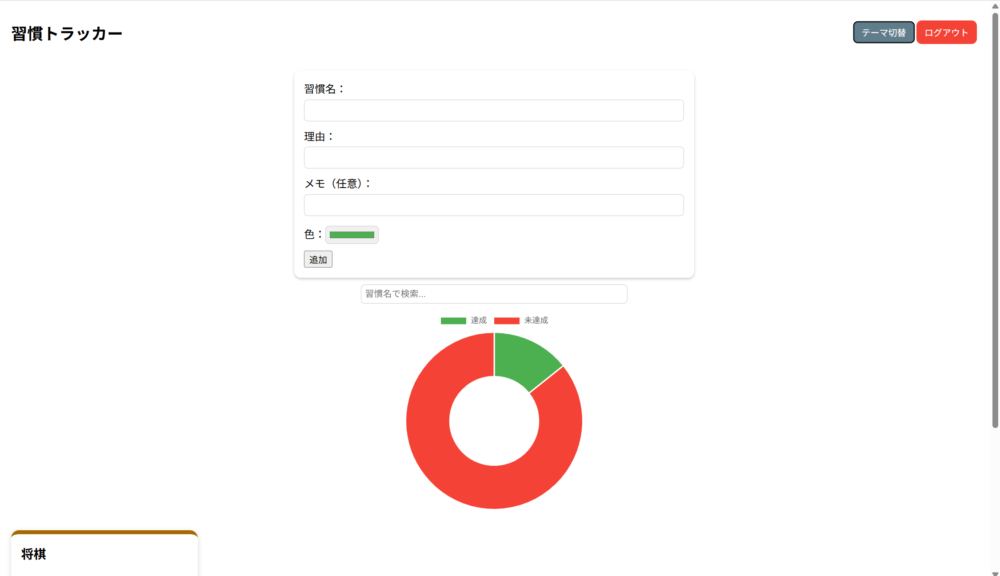
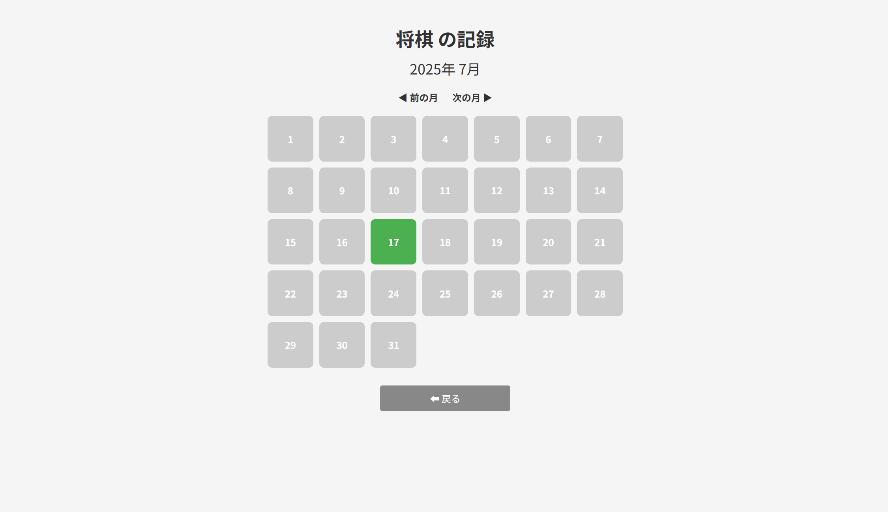

# 🌱 習慣トラッカー Webアプリ（my-app-2025）

毎日の習慣を記録・管理するための **シンプルかつ高機能な Web アプリ**です。習慣の達成状況や連続記録、月別カレンダーでの可視化など、**継続を助ける工夫が満載**です。

[▶️ アプリを開く](https://habits-tracker-i5b3.onrender.com)

---

## 📝 概要

「何かを継続したい」「三日坊主を卒業したい」  
そんな思いから生まれたのが、この**習慣トラッカー Webアプリ**です。  
あなたの日々の達成を記録し、**可視化して習慣化を後押し**します。

---

## 📸 スクリーンショット

---

## ✅ 主な機能

- ✏️ 習慣の登録／削除／カラー選択
- 📅 毎日の達成・未達成記録（未達成理由の記録も可能）
- 🔁 連続日数・合計達成日数のトラッキング
- 📈 円グラフによる週間達成率の表示
- 🏅 週間ハイライト（達成率トップの習慣）
- 📆 月別カレンダー表示（前月・翌月切り替え可）
- 🌙 ダークモード／ライトモード切替（ローカル保存対応）
- 🔍 習慣名での検索機能
- 🖱️ ドラッグ＆ドロップによるカード並び順の変更
- 🧑‍💻 ログイン・ログアウト機能（マルチユーザー対応）

---

## 💻 使用技術・ライブラリ

| 種類         | 内容 |
|--------------|------|
| バックエンド | Python / Flask |
| フロントエンド | HTML / CSS / JavaScript |
| グラフ描画    | [Chart.js](https://www.chartjs.org/)（週間達成率円グラフ） |
| 並び替え     | [Sortable.js](https://sortablejs.github.io/Sortable/)（習慣カードの並び替え） |

---

開発者：shion
